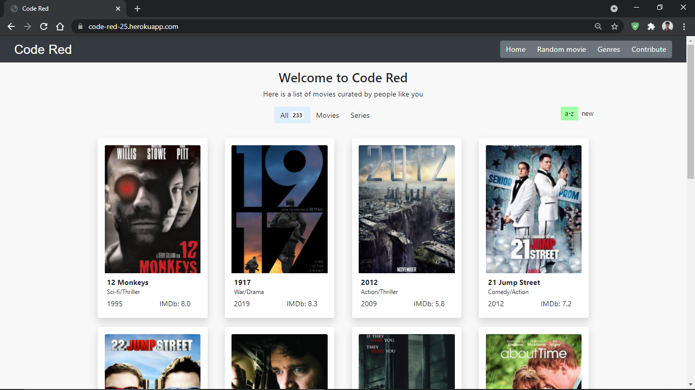
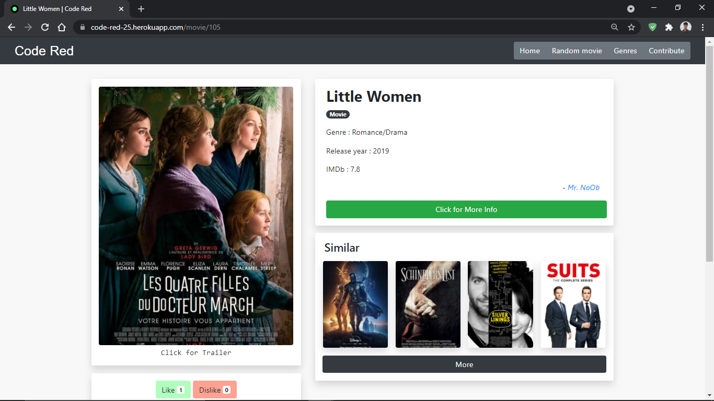

# Code Red
Movie review website using PostgreSQL, Python, Flask, HTML and Bootstrap.

## Screenshots




To view the webiste, click [here](https://code-red-25.herokuapp.com/)

## Local Dev setup

Run in terminal 
```
git clone <repo-url>

pip install -r requirements.txt
```
Add `DATABASE_URL = sqlite:///local.db` in your environment variables.

Go to project root folder and execute `python3 main.py`.

Go to `https://localhost:5000/ to see the site

Make changes to add features and add a Pull Request on GitHub.

## Issues

Find any issues? Add them to the issues tab on github
